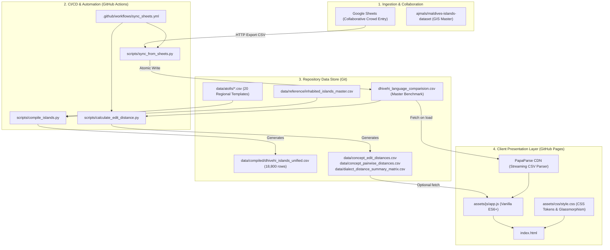
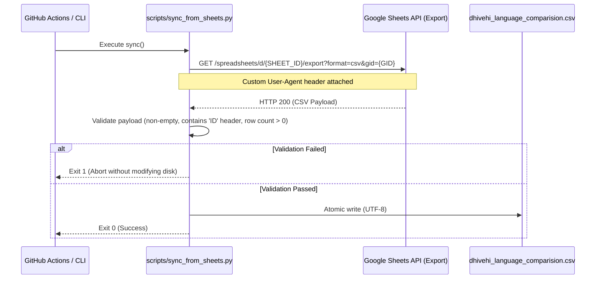
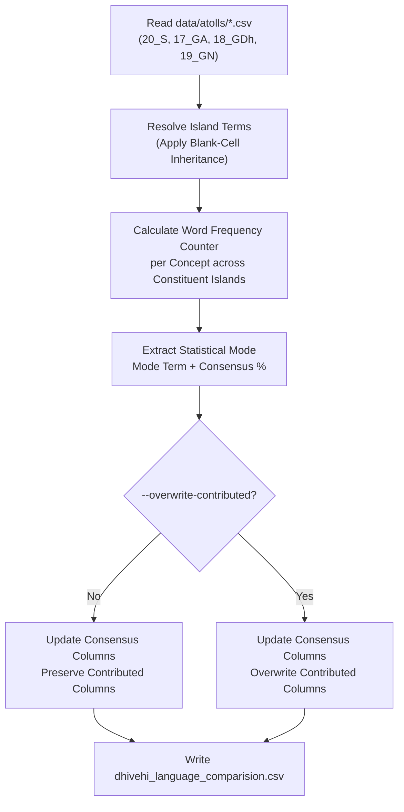
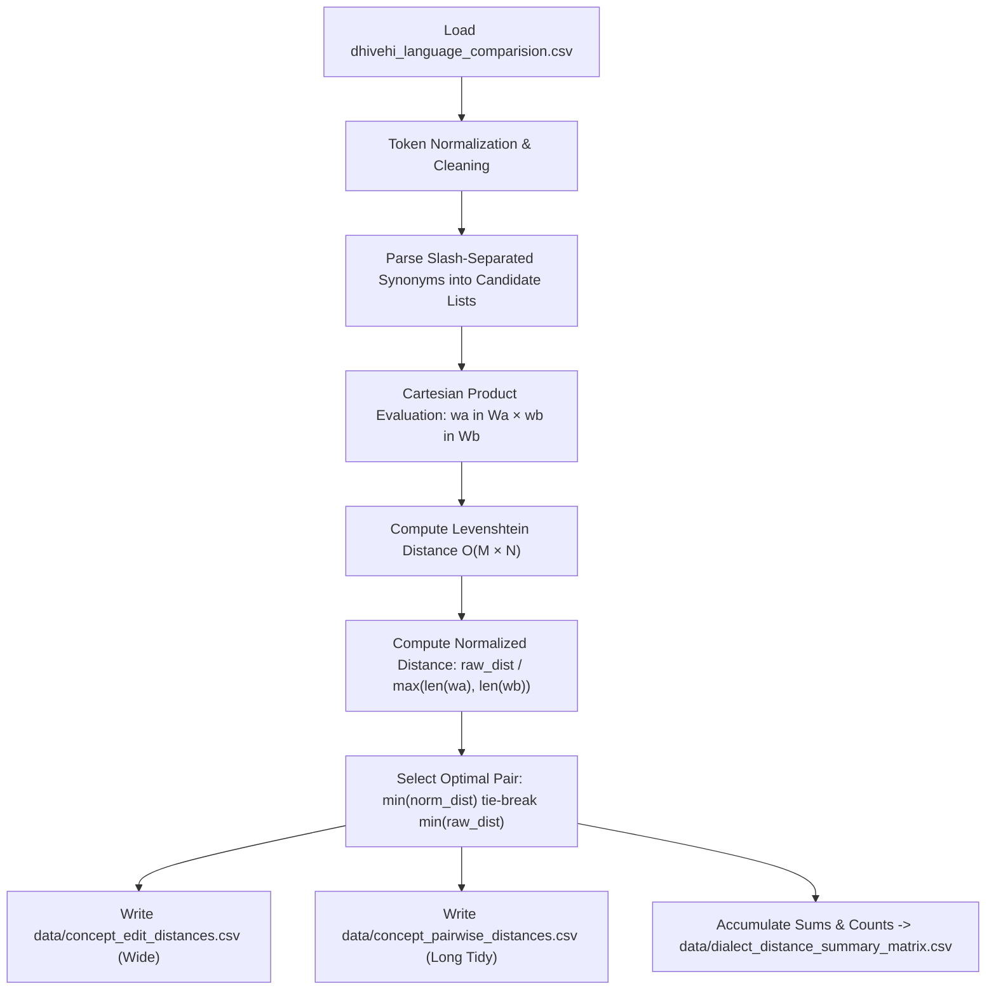
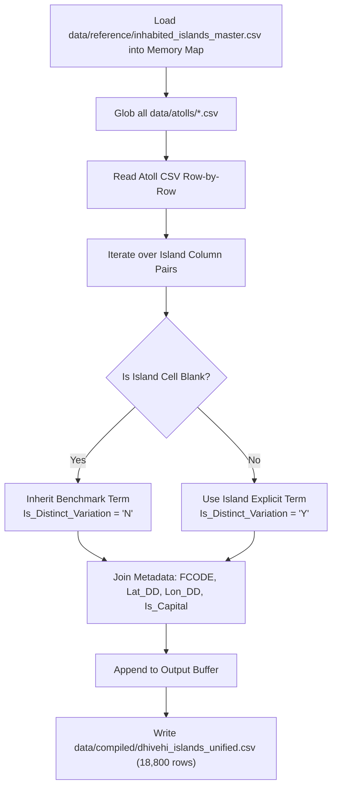
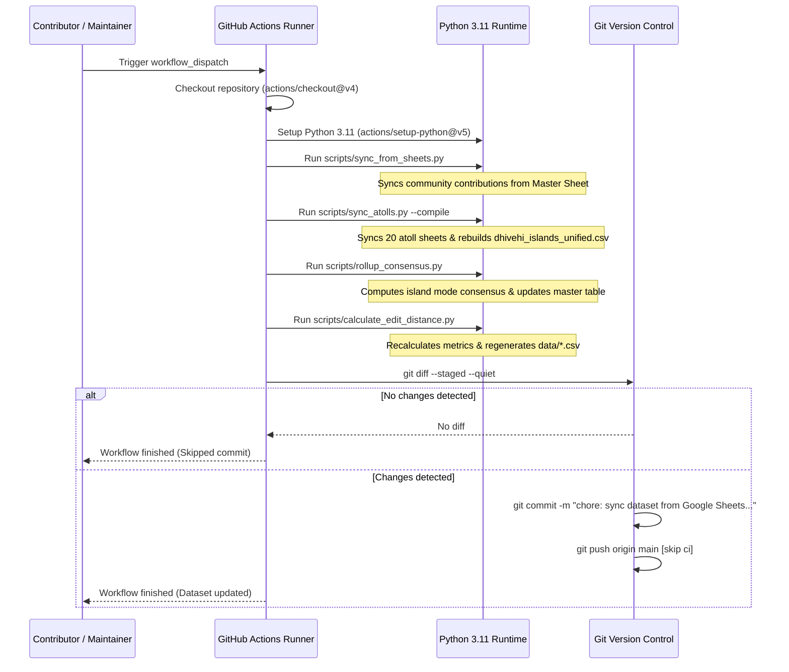

# Comparative Dhivehi Dialect Project — Technical Documentation & Architecture Manual

> **Engineering Manual & Systems Specification**  
> *Target Audience: Software Engineers, Data Engineers, Computational Linguists, and Open-Source Contributors.*  
> For the general project overview and linguistic introduction, see the [README.md](README.md). For field collection guidelines across all 188 islands, see the [Regional Atoll Guide](data/atolls/README.md).

---

## Table of Contents
1. [System Architecture & Data Flow](#1-system-architecture--data-flow)
2. [Data Schemas & Storage Design](#2-data-schemas--storage-design)
   - [2.1 Master Benchmark Dataset (`dhivehi_language_comparision.csv`)](#21-master-benchmark-dataset-dhivehi_language_comparisioncsv)
   - [2.2 Island-Level Micro-Dialectology (`data/atolls/*.csv`)](#22-island-level-micro-dialectology-dataatollscsv)
   - [2.3 Authoritative Island Registry (`data/reference/inhabited_islands_master.csv`)](#23-authoritative-island-registry-datareferenceinhabited_islands_mastercsv)
   - [2.4 Compiled Relational Dataset (`data/compiled/dhivehi_islands_unified.csv`)](#24-compiled-relational-dataset-datacompileddhivehi_islands_unifiedcsv)
   - [2.5 Dialectometry Analytical Datasets](#25-dialectometry-analytical-datasets)
3. [Pipelines & Automation Workflows](#3-pipelines--automation-workflows)
   - [3.1 Google Sheets Ingestion Pipeline (`scripts/sync_from_sheets.py`)](#31-google-sheets-ingestion-pipeline-scriptssync_from_sheetspy)
   - [3.2 Regional Atoll Google Sheets Sync (`scripts/sync_atolls.py`)](#32-regional-atoll-google-sheets-sync-scriptssync_atollspy)
   - [3.3 Island Consensus Rollup Pipeline (`scripts/rollup_consensus.py`)](#33-island-consensus-rollup-pipeline-scriptsrollup_consensuspy)
   - [3.4 Levenshtein Distance & Similarity Pipeline (`scripts/calculate_edit_distance.py`)](#34-levenshtein-distance--similarity-pipeline-scriptscalculate_edit_distancepy)
   - [3.5 Island Relational Compiler (`scripts/compile_islands.py`)](#35-island-relational-compiler-scriptscompile_islandspy)
   - [3.6 Google Drive Provisioning Pipeline (`scripts/upload_to_gdrive.py`)](#36-google-drive-provisioning-pipeline-scriptsupload_to_gdrivepy)
4. [CI/CD & Automation Workflow](#4-cicd--automation-workflow)
5. [Frontend Web Architecture (`index.html` & `assets/`)](#5-frontend-web-architecture-indexhtml--assets)
6. [Local Development & Environment Setup](#6-local-development--environment-setup)
7. [Data Quality, Normalization & Encoding Standards](#7-data-quality-normalization--encoding-standards)
8. [Security & Credentials Management](#8-security--credentials-management)
9. [Technical Roadmap & Extension Points](#9-technical-roadmap--extension-points)

---

## 1. System Architecture & Data Flow

The **Comparative Dhivehi Dialect Project** employs a hybrid static-data and pipeline-driven architecture. Linguistic data is collected collaboratively via cloud spreadsheets, ingested and transformed through idempotent Python pipelines, version-controlled in Git as immutable flat files, and served to end users via a zero-build, client-side web application hosted on GitHub Pages.

### Architectural Flowchart



### Key Engineering Characteristics
- **Git as Single Source of Truth**: Data artifacts are persisted as deterministic CSV flat files with line-level diffs, ensuring full historical provenance and reproducibility.
- **Stateless Batch Pipelines**: All transformation scripts are pure functions of their inputs, generating output files idempotently without external state or databases.
- **Serverless Presentation**: The frontend is a single-page application (SPA) with zero build steps (no Webpack, Vite, or Node.js runtime required at serving time), eliminating server maintenance and deployment overhead.

---

## 2. Data Schemas & Storage Design

The system organizes linguistic data across three distinct abstraction tiers:
1. **Tier 1 (Master Benchmarks)**: Broad atoll groupings compared against foreign cognates.
2. **Tier 2 (Island Templates)**: 20 per-atoll CSV files with individual island columns.
3. **Tier 3 (Compiled Relational)**: Fully denormalized, geocoded concept-island matrix.

```
data/
├── atolls/                             # Tier 2: 20 administrative atoll CSV files
│   ├── 01_HA_haa_alifu.csv
│   ├── ...
│   └── 20_S_seenu_addu.csv
├── compiled/                           # Tier 3: Denormalized relational dataset
│   └── dhivehi_islands_unified.csv
├── reference/                          # Authoritative geospatial metadata
│   └── inhabited_islands_master.csv
├── concept_edit_distances.csv          # Analytical: Concept-by-concept wide metrics
├── concept_pairwise_distances.csv      # Analytical: Tidy long-format pairwise records
└── dialect_distance_summary_matrix.csv # Analytical: Corpus-wide aggregate matrix
```

---

### 2.1 Master Benchmark Dataset (`dhivehi_language_comparision.csv`)

The central file of the repository. Contains 100 core vocabulary items based on the Swadesh list, organized under a **Hierarchical Dual-Input Model**:
- **Consensus Columns (`*- Consensus - *`)**: Generated deterministically by [`scripts/rollup_consensus.py`](scripts/rollup_consensus.py) from the 188 inhabited island ground truth datasets. Computed as the statistical mode (most frequent term) across an atoll's constituent islands:
  $$\text{Consensus}(C, D) = \arg\max_{w \in W} \sum_{i \in \text{Islands}(D)} \mathbb{I}(\text{resolve}(i, C) = w)$$
- **Contributed Columns (`*- Contributed - *`)**: Open for community volunteers to suggest general atoll-level terms directly. If corrupted or drifted, maintainers can run `python3 scripts/rollup_consensus.py --overwrite-contributed` to restore parity with the island ground truth.

#### Column Schema (24 Fields)

| Column Name | Type | Input Mode | Constraints | Description |
| :--- | :--- | :--- | :--- | :--- |
| `ID` | `String` | System | Primary Key, `^[A-Z0-9]+-[0-9]{3}$` | Unique identifier (e.g., `SW100-001`, `FRZ-001`). |
| `Word List` | `String` | Reference | Non-null | Source wordlist (e.g., `Swadesh 100`, `Fritz 2002 Texts`). |
| `Category` | `String` | Semantic | Non-null | Semantic domain (e.g., `Body Parts & Substances`, `Quantitatives`). |
| `English` | `String` | Gloss | Non-null | Reference English gloss/concept. |
| `Male' - Latin` | `String` | Standard Anchor | Non-null | Standard Maldivian in phonemic Latin transliteration. |
| `Male' - Thaana` | `String` | Standard Anchor | Non-null | Standard Maldivian in native Thaana script (`U+0780`–`U+07BF`). |
| `Addu - Consensus - Latin` | `String` | Computed (Mode) | Nullable | Statistical consensus across all 6 Addu islands in Latin. |
| `Addu - Consensus - Thaana` | `String` | Computed (Mode) | Nullable | Statistical consensus across all 6 Addu islands in Thaana. |
| `Addu - Contributed - Latin` | `String` | Community Input | Nullable | General Addu atoll term proposed by community contributors. |
| `Addu - Contributed - Thaana` | `String` | Community Input | Nullable | General Addu atoll term in native Thaana. |
| `Huvadhu - Consensus - Latin` | `String` | Computed (Mode) | Nullable | Statistical consensus across all 18 GA/GDh islands in Latin. |
| `Huvadhu - Consensus - Thaana` | `String` | Computed (Mode) | Nullable | Statistical consensus across all 18 GA/GDh islands in Thaana. |
| `Huvadhu - Contributed - Latin` | `String` | Community Input | Nullable | General Huvadhu atoll term proposed by community contributors. |
| `Huvadhu - Contributed - Thaana`| `String` | Community Input | Nullable | General Huvadhu atoll term in native Thaana. |
| `Fuvahmulah - Consensus - Latin`| `String` | Computed (Mode) | Nullable | Statistical consensus for Gnaviyani (Fuvahmulah) in Latin. |
| `Fuvahmulah - Consensus - Thaana`| `String` | Computed (Mode) | Nullable | Statistical consensus for Gnaviyani (Fuvahmulah) in Thaana. |
| `Fuvahmulah - Contributed - Latin`| `String` | Community Input| Nullable | General Fuvahmulah atoll term proposed by community contributors. |
| `Fuvahmulah - Contributed - Thaana`| `String` | Community Input| Nullable | General Fuvahmulah atoll term in native Thaana. |
| `Maliku - Latin` | `String` | Regional Anchor | Nullable | Maliku / Minicoy (Mahl) dialect benchmark in Latin transliteration. |
| `Maliku - Thaana` | `String` | Regional Anchor | Nullable | Maliku / Minicoy (Mahl) dialect benchmark in Thaana script. |
| `Sinhala` | `String` | External Cognate| Nullable | Sinhala cognate/equivalent in Latin transliteration (IAST diacritics). |
| `Malayalam` | `String` | External Cognate| Nullable | Malayalam cognate/equivalent in Latin transliteration (ISO 15919). |
| `Arabic` | `String` | External Cognate| Nullable | Arabic root/cognate in Latin transliteration. |
| `Notes` | `String` | Contextual | Nullable | Academic references, etymology, phonetic annotations. |

*Multi-term representation*: If a concept possesses multiple synonyms or variants within a dialect, items are delimited with a slash surrounded by whitespace: `Variant_1 / Variant_2`.

---

### 2.2 Island-Level Micro-Dialectology (`data/atolls/*.csv`)

Twenty administrative atoll CSV files cover all 188 inhabited islands of the Maldives.

#### Schema Pattern
Every file shares an identical prefix schema followed by dynamic, island-specific column pairs:

```
ID, Category, English, Standard Male' - Latin, Standard Male' - Thaana, Benchmark - Latin, Benchmark - Thaana, <Island_1> - Latin, <Island_1> - Thaana, ..., <Island_N> - Latin, <Island_N> - Thaana, Notes
```

- Administrative capital islands are placed first among the island columns (e.g., `Hithadhoo` in `20_S_seenu_addu.csv`).
- **The Blank-Cell Inheritance Rule**: When `<Island_X> - Latin` and `<Island_X> - Thaana` are empty, downstream pipelines resolve the value by falling back to `Benchmark - Latin` and `Benchmark - Thaana`. This avoids duplicating 85–95% of identical vocabulary across neighboring islands.

---

### 2.3 Authoritative Island Registry (`data/reference/inhabited_islands_master.csv`)

Imported from [`ajmals/maldives-islands-dataset`](https://github.com/ajmals/maldives-islands-dataset) to ensure strict geospatial and administrative alignment.

| Field | Type | Description |
| :--- | :--- | :--- |
| `Atl` | `String` | 2-letter atoll code (`HA`, `HDh`, ..., `S`). |
| `Atoll_Name` | `String` | Official administrative atoll name (`Haa Alifu`, etc.). |
| `Island_Name` | `String` | Official Latin transliteration of the island name. |
| `Island_Dhivehi` | `String` | Official island name in Thaana script. |
| `FCODE` | `String` | Maldives Land and Survey Authority (MLSA) feature code (e.g., `LD0568`). |
| `Is_Capital` | `Enum('Y', 'N')` | Flag indicating whether the island is the administrative capital of the atoll. |
| `Lat_DD` | `Float` | Latitude coordinate in Decimal Degrees (WGS84). |
| `Lon_DD` | `Float` | Longitude coordinate in Decimal Degrees (WGS84). |

---

### 2.4 Compiled Relational Dataset (`data/compiled/dhivehi_islands_unified.csv`)

Generated by [`scripts/compile_islands.py`](scripts/compile_islands.py). Represents a fully normalized Cartesian expansion:

$$\text{Total Records} = 100 \text{ concepts} \times 188 \text{ inhabited islands} = 18,800 \text{ rows}$$

#### Unified Record Schema

```
Concept_ID, Category, English, Atoll_Code, Atoll_Name, Island_Name, Island_Dhivehi, FCODE, Is_Capital, Term_Latin, Term_Thaana, Is_Distinct_Variation, Male_Reference_Latin, Male_Reference_Thaana, Benchmark_Latin, Benchmark_Thaana, Lat_DD, Lon_DD, Notes
```

- `Is_Distinct_Variation`: Set to `Y` if the island cell contained an explicit override, or `N` if resolved via benchmark inheritance.
- Spatial-ready: Direct ingestion compatibility with GIS tools (QGIS, PostGIS, GeoPandas) and Web mapping libraries (Mapbox GL, Leaflet.js).

---

### 2.5 Dialectometry Analytical Datasets

Generated by [`scripts/calculate_edit_distance.py`](scripts/calculate_edit_distance.py):

1. **`data/concept_edit_distances.csv` (Wide Format)**:
   - Evaluates each concept across all dialect pairs and external languages against Male'.
   - Identifies `Male_Closest_Dhivehi_Dialect`, `Male_Closest_Foreign_Lang`, and overall closest intra-Dhivehi pair per concept.
2. **`data/concept_pairwise_distances.csv` (Tidy Long Format)**:
   - Normalized pairwise schema: `[ID, Word List, Category, English, Entity_A, Entity_B, Word_A, Word_B, Raw_Distance, Normalized_Distance, Similarity_Pct, Is_Dhivehi_Pair]`.
   - Designed for direct ingestion into pandas, R (`ggplot2`, `lme4`), or scikit-learn.
3. **`data/dialect_distance_summary_matrix.csv` (Aggregate Distance Matrix)**:
   - Symmetric $8 \times 8$ matrix summarizing cross-dialect lexical distances across the full corpus.
   - Values formatted as `Avg_Norm_Dist (Avg_Sim_Pct%) [n=Count]`.

---

## 3. Pipelines & Automation Workflows

All pipelines are implemented in Python 3 with zero required C-extensions, using standard library modules (`csv`, `re`, `urllib.request`, `itertools`, `pathlib`) for core computations.

---

### 3.1 Google Sheets Ingestion Pipeline (`scripts/sync_from_sheets.py`)

Synchronizes community-contributed corrections from the live collaborative Google Sheet into the local master CSV.



#### Verification & Safety Checks
- Verifies that the HTTP payload begins with expected tabular headers (`ID`, `Word List`, `Category`, `English`).
- Validates row counts before overwriting `dhivehi_language_comparision.csv`.
- Uses UTF-8 encoding explicitly to protect Thaana and diacritic characters.

---

### 3.2 Regional Atoll Google Sheets Sync (`scripts/sync_atolls.py`)

Synchronizes all 20 regional atoll spreadsheets from the collaborative Google Drive folder directly into `data/atolls/*.csv`.

- **Configuration Map (`scripts/atoll_sheets_config.json`)**: Persists the mapping between the 20 administrative atolls and their respective Google Sheets document IDs.
- **Direct HTTP Ingestion**: Leverages Google Sheets' public CSV export endpoint (`https://docs.google.com/spreadsheets/d/{sheet_id}/export?format=csv`), eliminating API token overhead.
- **Validation**: Verifies header presence (`ID`, `Category`, `English`, `Standard Male' - Latin`) and ensures row count exceeds safety thresholds before overwriting files.
- **Chained Compilation**: Invoking with `--compile` automatically triggers `scripts/compile_islands.py` to regenerate the unified 18,800-row dataset (`data/compiled/dhivehi_islands_unified.csv`).
- **Granular Controls**: Supports `--atoll <code_or_name>` to target a single atoll (e.g. `python3 scripts/sync_atolls.py --atoll S`), and `--dry-run` for non-destructive schema checks.

---

### 3.3 Island Consensus Rollup Pipeline (`scripts/rollup_consensus.py`)

Aggregates island-level micro-dialect ground truth into the master comparison dataset, computing statistical consensus values while safeguarding community-contributed terms.



#### Operational Workflow:
- **Constituent Island Mapping**:
  - **Addu**: Evaluates all 6 islands from `20_S_seenu_addu.csv` (Hithadhoo, Maradhoo, Maradhoo-Feydhoo, Feydhoo, Hulhudhoo, Meedhoo).
  - **Huvadhu**: Evaluates all 18 islands across `17_GA_gaafu_alifu.csv` (9 islands) and `18_GDh_gaafu_dhaalu.csv` (9 islands).
  - **Fuvahmulah**: Evaluates the single island from `19_GN_gnaviyani.csv`.
- **Mode Calculation**: Resolves each island's term using the inheritance model and computes the frequency distribution. In ties, priority is given to the benchmark or capital island.
- **Accidental Edit Protection**:
  - By default, existing contributor input in `*- Contributed - *` is preserved, while `*- Consensus - *` reflects pure island statistics.
  - If a contributor corrupts a contributed column, running `python3 scripts/rollup_consensus.py --overwrite-contributed` immediately restores parity.
  - Running with `--verify` outputs a divergence report showing concepts where community suggestions differ from island consensus.

---

### 3.4 Levenshtein Distance & Similarity Pipeline (`scripts/calculate_edit_distance.py`)

Computes string-level edit distances and similarity percentages across all permutations of dialects and foreign languages.



#### Mathematical Formulation

Given two candidate words $w_a$ and $w_b$:

$$\text{Levenshtein}(w_a, w_b) = \begin{cases} 
|w_a| & \text{if } |w_b| = 0 \\
|w_b| & \text{if } |w_a| = 0 \\
\text{Levenshtein}(\text{tail}(w_a), \text{tail}(w_b)) & \text{if } w_a[0] = w_b[0] \\
1 + \min \begin{cases} 
\text{Levenshtein}(\text{tail}(w_a), w_b) \\
\text{Levenshtein}(w_a, \text{tail}(w_b)) \\
\text{Levenshtein}(\text{tail}(w_a), \text{tail}(w_b))
\end{cases} & \text{otherwise}
\end{cases}$$

Normalized Levenshtein Distance ($\text{NormDist}$):

$$\text{NormDist}(w_a, w_b) = \frac{\text{Levenshtein}(w_a, w_b)}{\max(|w_a|, |w_b|)}, \quad \text{where } \text{NormDist} \in [0.0, 1.0]$$

Similarity Score ($\text{Sim}$):

$$\text{Sim}(w_a, w_b) = (1.0 - \text{NormDist}(w_a, w_b)) \times 100\%$$

#### Multi-Synonym Optimal Match Selection
When a concept lists multiple variants (e.g., `Male'`: `Dhaigathun / Dhaielhun`, `Addu`: `Dheyvun`):

$$(w_a^*, w_b^*) = \arg\min_{\substack{w_a \in W_a \\ w_b \in W_b}} \text{NormDist}(w_a, w_b)$$

Ties are broken by minimum raw edit distance.

---

### 3.5 Island Relational Compiler (`scripts/compile_islands.py`)

Transforms the 20 atoll template CSV files into a unified dataset enriched with GIS coordinates.



#### Blank Cell Inheritance Logic
```python
if not isl_latin and not isl_thaana:
    term_latin = bench_latin
    term_thaana = bench_thaana
    is_variation = False
else:
    term_latin = isl_latin or bench_latin
    term_thaana = isl_thaana or bench_thaana
    is_variation = (isl_latin != bench_latin) or (isl_thaana != bench_thaana)
```

---

### 3.6 Google Drive Provisioning Pipeline (`scripts/upload_to_gdrive.py`)

Automates uploading local atoll templates to Google Drive, converting them into cloud-collaborative native Google Sheets via the Google Drive API v3.

- **Authentication**: OAuth 2.0 with desktop client flow (`InstalledAppFlow`), using local `credentials.json` and cached token `token.json` (both git-ignored).
- **Scope**: `https://www.googleapis.com/auth/drive.file`.
- **MIME Conversion**: Uploads CSV with target MIME type `application/vnd.google-apps.spreadsheet`, instructing Google Drive to auto-convert tabular data into native Google Sheets.

---

## 4. CI/CD & Automation Workflow

The repository includes an automated workflow defined in [`.github/workflows/sync_sheets.yml`](.github/workflows/sync_sheets.yml).



### Workflow Configuration Summary
- **Trigger**: `workflow_dispatch` (manual trigger from GitHub Actions UI; can be configured with cron triggers for scheduled syncs).
- **Permissions**: `contents: write` (permits the GitHub Actions bot to commit and push changes back to the repository).
- **Commit Guard**: Uses `[skip ci]` in the commit message to prevent recursive workflow invocations.

---

## 5. Frontend Web Architecture (`index.html` & `assets/`)

The web application is an ultra-fast, zero-build client-side explorer accessible via GitHub Pages.

```
index.html                     # Semantic HTML5 markup, accessible landmarks, meta tags
assets/
├── css/
│   └── style.css              # Custom property design tokens, dark/light theme, glassmorphism
└── js/
    └── app.js                 # Reactive state store, CSV streaming, DOM rendering, SVG visualizer
```

### Component Breakdown & State Management

The frontend state is managed through a central reactive object in [`assets/js/app.js`](assets/js/app.js):

```javascript
const state = {
  data: [],                   // Master dataset loaded via PapaParse
  filteredData: [],           // Current view filtered by search & categories
  searchTerm: '',             // Real-time search query
  selectedCategory: 'ALL',     // Selected semantic category chip
  scriptMode: 'both',         // 'both' | 'thaana' | 'latin'
  viewMode: 'table',          // 'table' | 'cards'
  sortColumn: 'id',           // Active sort key
  sortAsc: true,              // Sort direction
  visibleCols: { ... },       // Dialect column visibility map
  theme: 'dark',              // 'dark' | 'light' persisted in localStorage
  activeTab: 'explorer',      // 'explorer' | 'proximity'
  proxSearch: '',
  proxCategory: 'ALL',
  proxSort: 'id-asc',
};
```

### Key Technical Features

1. **Streaming CSV Ingestion**:
   Uses `PapaParse` via CDN to stream and parse `dhivehi_language_comparision.csv` asynchronously upon page load, caching the parsed records in client memory.
2. **Bi-Directional Multilingual Rendering**:
   Handles mixed Latin (LTR) and native Thaana (RTL) typography seamlessly using `Noto Sans Thaana` webfonts and dynamic CSS text-direction tags (`dir="rtl"`).
3. **Dual View Presentation**:
   - **Table View**: High-density comparative view with sticky headers, column sorting, and horizontal scrolling for wide comparison.
   - **Card Grid View**: Responsive flex cards displaying terms side-by-side with color-coded dialect badges.
4. **Dialect Proximity Visualizer**:
   Computes on-the-fly pairwise Levenshtein similarity percentages directly in browser memory and renders SVG radar and bar graphics without external charting libraries.
5. **Client-Side Export**:
   Allows instant client-side filtering and export of active search results to CSV or JSON formats.

---

## 6. Local Development & Environment Setup

### Prerequisites
- Python 3.10 or higher
- Git
- Modern web browser (Chrome, Firefox, Safari, Edge)

### Setup Instructions

```bash
# 1. Clone repository
git clone https://github.com/ajmals/comparative-dhivehi-dialect-project.git
cd comparative-dhivehi-dialect-project

# 2. Create and activate a Python virtual environment
python3 -m venv .venv
source .venv/bin/activate  # On Windows: .venv\Scripts\activate

# 3. Install dependencies
pip install -r scripts/requirements.txt
```

### Running Pipelines Locally

```bash
# Synchronize master dataset from live Google Sheet
python3 scripts/sync_from_sheets.py

# Recalculate Levenshtein edit distances and regenerate analysis matrices
python3 scripts/calculate_edit_distance.py

# Recompile all 20 atoll templates into the 18,800-row unified dataset
python3 scripts/compile_islands.py
```

### Running the Web App Locally

Because the frontend fetches `dhivehi_language_comparision.csv` via HTTP `fetch()`, opening `index.html` directly as `file://` may be blocked by browser CORS security policies. Run a lightweight local HTTP server:

```bash
# Start local server from the repository root
python3 -m http.server 8000

# Open in browser:
# http://localhost:8000
```

---

## 7. Data Quality, Normalization & Encoding Standards

To maintain high integrity across computational pipelines:

### 1. UTF-8 & BOM Handling
- All files are strictly encoded in **UTF-8**.
- Ingestion scripts utilize Python's `utf-8-sig` when reading external CSVs to transparently strip Byte Order Marks (BOMs) emitted by spreadsheet software like Microsoft Excel.

### 2. Thaana Unicode Representation
- Thaana text uses standard Unicode block characters (`U+0780` through `U+07BF`).
- Consonants are paired with corresponding vowel marks (Fili):
  - `Aabaafili` (`U+07A6`), `Aabaafili` (`U+07A7`), `Ibifili` (`U+07A8`), `Eebeefili` (`U+07A9`), `Ubufili` (`U+07AA`), `Ooboofili` (`U+07AB`), `Ebefili` (`U+07AC`), `Eeybeefili` (`U+07AD`), `Obofili` (`U+07AE`), `Oaboafili` (`U+07AF`), `Sukun` (`U+07B0`).
- Normalized to NFC (Canonical Decomposition followed by Canonical Composition) to prevent disjoint diacritics.

### 3. Diacritic Transliteration (Cognates)
- External language columns (Sinhala, Malayalam, Arabic) use ISO 15919 and IAST standards (e.g., macrons $\bar{a}$, underdots $ḍ, ṭ, ḻ$, viramas).
- The string cleaning function in `scripts/calculate_edit_distance.py` strips extraneous metadata tags such as `(pl.)`, `(adj.)`, or brackets before distance calculation.

---

## 8. Security & Credentials Management

1. **OAuth Credentials Isolation**:
   - `credentials.json` (Google Cloud OAuth Client ID) and `token.json` (OAuth User Token) are strictly listed in `.gitignore`.
   - Never commit API keys or private credentials to git history.
2. **Read-Only Public Cloud Fetch**:
   - `scripts/sync_from_sheets.py` uses public CSV export links without exposing write credentials.
3. **Workflow Least Privilege**:
   - The GitHub Actions workflow scopes permissions strictly to `contents: write` for updating repository flat files.

---

## 9. Technical Roadmap & Extension Points

| Feature | Description | Architecture / Implementation Path |
| :--- | :--- | :--- |
| **Automated Cron Sync** | Schedule daily/weekly sync from Google Sheets | Add `schedule: - cron: '0 4 * * 1'` to `sync_sheets.yml`. |
| **Phonetic Distance Metric** | Phonology-aware dialect distance beyond Levenshtein | Implement ASJP (Automated Similarity Judgment Program) or IPA distinctive feature distance matrices. |
| **Interactive GIS Dialect Map** | Spatial visualization of word variation across atolls | Integrate Leaflet.js / MapLibre with `dhivehi_islands_unified.csv` and GeoJSON island boundaries. |
| **REST / GraphQL Static API** | Programmatic access for external NLP researchers | Generate pre-built static JSON payloads (`api/v1/concepts.json`, `api/v1/islands.json`) during compilation. |
| **Automated Schema Validator** | Lint CSV files for header mismatches, missing IDs, or corrupt UTF-8 | Add a pre-commit hook or GitHub Actions validation step using `pydantic` or `frictionless`. |

---

*Document version: 1.0 (October 2026)*  
*Maintained by the Comparative Dhivehi Dialect Project team.*
